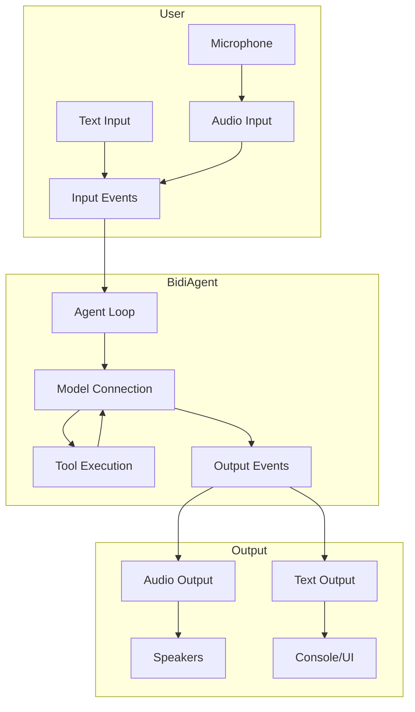
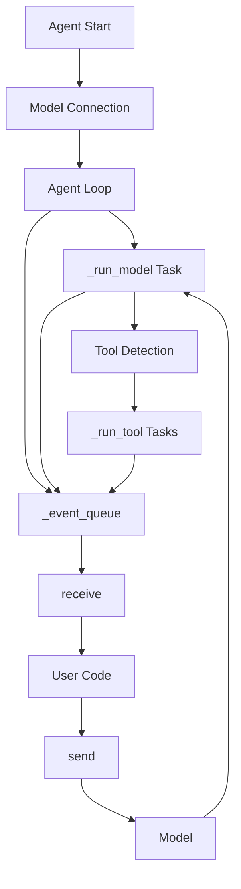
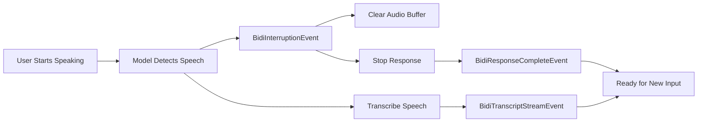
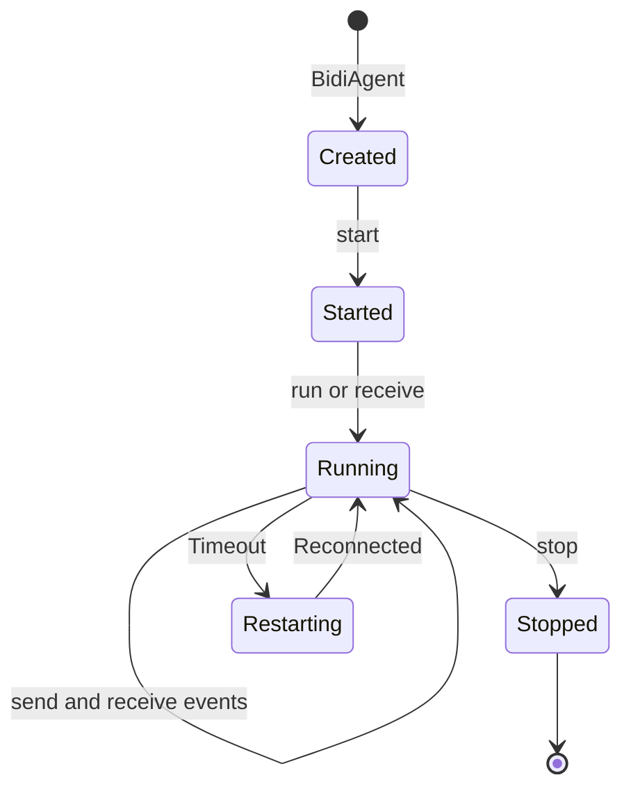

# BidiAgent

The `BidiAgent` is a specialized agent designed for real-time bidirectional streaming conversations. Unlike the standard `Agent` that follows a request-response pattern, `BidiAgent` maintains persistent connections that enable continuous audio and text streaming, real-time interruptions, and concurrent tool execution.


## What is BidiAgent?

`BidiAgent` extends the core agent concept to support real-time, bidirectional communication with AI models. It's designed for applications that require:

- **Real-time voice conversations** with natural interruptions
- **Continuous audio streaming** in both directions simultaneously
- **Persistent connections** that handle multiple conversation turns
- **Concurrent tool execution** without blocking the conversation
- **Multi-modal interactions** combining audio, text, and images



The key difference from standard agents is that `BidiAgent` operates on a **persistent connection** where input and output happen concurrently, rather than in discrete request-response cycles.


## Agent vs BidiAgent

While both `Agent` and `BidiAgent` share the same core purpose of enabling AI-powered interactions, they differ significantly in their architecture and use cases.

### Standard Agent (Request-Response)

The standard `Agent` follows a traditional request-response pattern:

```python
from strands import Agent
from strands_tools import calculator

agent = Agent(tools=[calculator])

# Single request-response cycle
result = agent("Calculate 25 * 48")
print(result.message)  # "The result is 1200"
```

**Characteristics:**

- **Synchronous interaction**: One request, one response
- **Discrete cycles**: Each invocation is independent
- **Message-based**: Operates on complete messages
- **Tool execution**: Sequential, blocking the response
- **State management**: Conversation history in `messages` array
- **Use cases**: Chatbots, CLI tools, batch processing, API endpoints

### BidiAgent (Bidirectional Streaming)

`BidiAgent` maintains a persistent, bidirectional connection:

```python
import asyncio
from strands.experimental.bidi import BidiAgent, BidiAudioIO
from strands.experimental.bidi.models import BidiNovaSonicModel

model = BidiNovaSonicModel()
agent = BidiAgent(model=model, tools=[calculator])
audio_io = BidiAudioIO()

async def main():
    # Persistent connection with continuous streaming
    await agent.run(
        inputs=[audio_io.input()],
        outputs=[audio_io.output()]
    )

asyncio.run(main())
```

**Characteristics:**

- **Asynchronous streaming**: Continuous input/output
- **Persistent connection**: Single connection for multiple turns
- **Event-based**: Operates on streaming events
- **Tool execution**: Concurrent, non-blocking
- **State management**: Conversation history + connection state
- **Use cases**: Voice assistants, real-time chat, live transcription, interactive applications

### When to Use Each

**Use `Agent` when:**

- Building chatbots or CLI applications
- Processing discrete requests
- Implementing API endpoints
- Working with text-only interactions
- Simplicity is preferred

**Use `BidiAgent` when:**

- Building voice assistants
- Requiring real-time audio streaming
- Needing natural conversation interruptions
- Implementing live transcription
- Building interactive, multi-modal applications


## The Bidirectional Agent Loop

The bidirectional agent loop is fundamentally different from the standard agent loop. Instead of processing discrete messages, it continuously streams events in both directions while managing connection state and concurrent operations.

### Architecture Overview



### Core Components

#### 1. Event Queue

The loop uses a bounded queue (`maxsize=1`) to manage backpressure:

```python
self._event_queue = asyncio.Queue(maxsize=1)
```

This design ensures:

- **Backpressure control**: Model receiver blocks if user isn't consuming events
- **Memory bounded**: Prevents unbounded event accumulation
- **Sequential delivery**: Events processed in order

#### 2. Task Pool

All background tasks are tracked in a `_TaskPool`:

```python
self._task_pool = _TaskPool()
self._task_pool.create(self._run_model())  # Model receiver task
self._task_pool.create(self._run_tool(tool_use))  # Tool execution tasks
```

Benefits:

- **Clean shutdown**: All tasks cancelled on stop
- **Error propagation**: Task exceptions captured and queued
- **Concurrent execution**: Multiple tools run simultaneously

#### 3. Send Gate

A gate controls sending during connection restarts:

```python
self._send_gate = asyncio.Event()
self._send_gate.set()  # Allow sending
self._send_gate.clear()  # Block sending during restart
```

This prevents race conditions when reconnecting after timeouts.

#### 4. Message Lock

Ensures paired messages (tool use + result) are added sequentially:

```python
async with self._message_lock:
    self._agent.messages.append(tool_use_message)
    self._agent.messages.append(tool_result_message)
```

Critical for maintaining conversation history integrity.

### Event Flow

#### Startup Sequence

1. **Agent Initialization**
   ```python
   agent = BidiAgent(model=model, tools=[calculator])
   ```
   - Creates tool registry
   - Initializes agent state
   - Sets up hook registry

2. **Connection Start**
   ```python
   await agent.start()
   ```
   - Calls `model.start(system_prompt, tools, messages)`
   - Establishes WebSocket/SDK connection
   - Sends conversation history if provided
   - Spawns `_run_model()` background task
   - Sets `_send_gate` to allow sending

3. **Event Processing**
   ```python
   async for event in agent.receive():
       # Process events
   ```
   - Dequeues events from `_event_queue`
   - Yields to user code
   - Continues until stopped

#### Model Event Processing

The `_run_model()` task continuously streams events from the model:

```python
async def _run_model(self) -> None:
    try:
        async for event in self._agent.model.receive():
            await self._event_queue.put(event)
            
            if isinstance(event, BidiTranscriptStreamEvent):
                if event["is_final"]:
                    # Add to message history
                    message = {"role": event["role"], "content": [{"text": event["text"]}]}
                    await self._add_messages(message)
            
            elif isinstance(event, ToolUseStreamEvent):
                # Spawn concurrent tool execution
                tool_use = event["current_tool_use"]
                self._task_pool.create(self._run_tool(tool_use))
    
    except Exception as error:
        await self._event_queue.put(error)
```

Key behaviors:

- **Continuous streaming**: Runs until connection closes or error
- **Event queueing**: All events go through the queue
- **Tool spawning**: Creates concurrent tasks for tool execution
- **Message tracking**: Adds final transcripts to history
- **Error handling**: Exceptions queued for user handling

#### Tool Execution

Tools execute concurrently without blocking the conversation:

```python
async def _run_tool(self, tool_use: ToolUse) -> None:
    tool_results = []
    
    # Execute tool with invocation state
    tool_events = self._agent.tool_executor._stream(
        self._agent,
        tool_use,
        tool_results,
        invocation_state,
        structured_output_context=None,
    )
    
    async for tool_event in tool_events:
        await self._event_queue.put(tool_event)
    
    # Add paired messages to history
    async with self._message_lock:
        tool_use_message = {"role": "assistant", "content": [{"toolUse": tool_use}]}
        tool_result_message = {"role": "user", "content": [{"toolResult": tool_result}]}
        await self._add_messages(tool_use_message, tool_result_message)
    
    # Send result to model (unless stop_conversation tool)
    if tool_use["name"] != "stop_conversation":
        await self.send(tool_result_event)
```

Features:

- **Concurrent execution**: Multiple tools run simultaneously
- **Event streaming**: Tool events queued as they occur
- **Message pairing**: Tool use + result added atomically
- **Result forwarding**: Automatically sent back to model
- **Special handling**: `stop_conversation` tool triggers shutdown

### Connection Lifecycle

#### Normal Operation

```
User → send() → Model → receive() → _run_model() → _event_queue → receive() → User
                  ↓
              Tool Use
                  ↓
            _run_tool() → _event_queue → receive() → User
                  ↓
            Tool Result → Model
```

#### Timeout and Recovery

When a model times out (e.g., Nova Sonic's 8-minute limit):

```python
async def _restart_connection(self, timeout_error: BidiModelTimeoutError) -> None:
    # Block sending
    self._send_gate.clear()
    
    # Invoke hooks
    await self._agent.hooks.invoke_callbacks_async(
        BidiBeforeConnectionRestartEvent(self._agent, timeout_error)
    )
    
    # Restart model with full history
    await self._agent.model.stop()
    await self._agent.model.start(
        self._agent.system_prompt,
        self._agent.tool_registry.get_all_tool_specs(),
        self._agent.messages,
        **timeout_error.restart_config
    )
    
    # Spawn new receiver task
    self._task_pool.create(self._run_model())
    
    # Invoke hooks
    await self._agent.hooks.invoke_callbacks_async(
        BidiAfterConnectionRestartEvent(self._agent, None)
    )
    
    # Unblock sending
    self._send_gate.set()
```

This provides seamless reconnection without losing conversation context.

## Interruptions

One of the most powerful features of `BidiAgent` is its ability to handle real-time interruptions. When a user starts speaking while the model is generating a response, the agent automatically detects this and stops the current response, allowing for natural, human-like conversations.

### How Interruptions Work

Interruptions are detected through Voice Activity Detection (VAD) built into the model providers:



### Interruption Flow

1. **Detection**: Model's VAD detects user speech
2. **Event Emission**: `BidiInterruptionEvent` sent to loop
3. **Buffer Clearing**: Audio output buffer cleared immediately
4. **Response Termination**: Current response marked as interrupted
5. **Transcription**: User's speech transcribed and processed
6. **Ready State**: Model ready to respond to new input

### Handling Interruptions

#### Automatic Handling (Default)

When using `BidiAudioIO`, interruptions are handled automatically:

```python
import asyncio
from strands.experimental.bidi import BidiAgent, BidiAudioIO
from strands.experimental.bidi.models import BidiNovaSonicModel

model = BidiNovaSonicModel()
agent = BidiAgent(model=model)
audio_io = BidiAudioIO()

async def main():
    # Interruptions handled automatically
    await agent.run(
        inputs=[audio_io.input()],
        outputs=[audio_io.output()]
    )

asyncio.run(main())
```

The `BidiAudioIO` output automatically:
- Clears the audio buffer on `BidiInterruptionEvent`
- Stops playback immediately
- Resumes normal operation for the next response

#### Manual Handling

For custom behavior, process interruption events manually:

```python
import asyncio
from strands.experimental.bidi import BidiAgent
from strands.experimental.bidi.models import BidiNovaSonicModel
from strands.experimental.bidi.types.events import (
    BidiInterruptionEvent,
    BidiResponseCompleteEvent
)

model = BidiNovaSonicModel()
agent = BidiAgent(model=model)

async def main():
    await agent.start()
    await agent.send("Tell me a long story")
    
    async for event in agent.receive():
        if isinstance(event, BidiInterruptionEvent):
            print(f"Interrupted: {event.reason}")
            # Custom handling:
            # - Update UI to show interruption
            # - Log analytics
            # - Clear custom buffers
            
        elif isinstance(event, BidiResponseCompleteEvent):
            if event.stop_reason == "interrupted":
                print("Response was interrupted by user")
            break
    
    await agent.stop()

asyncio.run(main())
```

### Interruption Events

#### BidiInterruptionEvent

Emitted when the model detects an interruption:

```python
BidiInterruptionEvent(
    reason="user_speech"  # or "error"
)
```

**Properties:**
- `reason`: Why the interruption occurred
  - `"user_speech"`: User started speaking (most common)
  - `"error"`: Error condition caused interruption

#### BidiResponseCompleteEvent

Includes interruption status:

```python
BidiResponseCompleteEvent(
    response_id="resp_123",
    stop_reason="interrupted"  # or "complete", "error", "tool_use"
)
```

**Stop Reasons:**
- `"complete"`: Response finished normally
- `"interrupted"`: Response interrupted by user
- `"error"`: Error occurred
- `"tool_use"`: Model requested tool execution

### Interruption Hooks

Use hooks to track interruptions across your application:

```python
from strands.experimental.bidi import BidiAgent
from strands.experimental.bidi.hooks.events import BidiInterruptionEvent as BidiInterruptionHookEvent

class InterruptionTracker:
    def __init__(self):
        self.interruption_count = 0
    
    async def on_interruption(self, event: BidiInterruptionHookEvent):
        self.interruption_count += 1
        print(f"Interruption #{self.interruption_count}: {event.reason}")
        
        # Log to analytics
        # Update UI
        # Track user behavior

tracker = InterruptionTracker()
agent = BidiAgent(
    model=model,
    hooks=[tracker]
)
```

### Provider-Specific Behavior

Different model providers handle interruptions slightly differently:

#### Nova Sonic

- **VAD**: Built-in, always active
- **Detection**: Fast, optimized for low latency
- **Interruption Signal**: `stopReason: INTERRUPTED` in events
- **Recovery**: Immediate, ready for new input

#### OpenAI Realtime

- **VAD**: Server-side, configurable
- **Detection**: Configurable threshold and silence duration
- **Interruption Signal**: `input_audio_buffer.speech_started` event
- **Recovery**: Automatic, with `response.cancelled` event

```python
from strands.experimental.bidi.models import BidiOpenAIRealtimeModel

model = BidiOpenAIRealtimeModel(
    provider_config={
        "turn_detection": {
            "type": "server_vad",
            "threshold": 0.5,  # Sensitivity (0.0-1.0)
            "prefix_padding_ms": 300,  # Audio before speech
            "silence_duration_ms": 500  # Silence to end turn
        }
    }
)
```

#### Gemini Live

- **VAD**: Built-in, automatic
- **Detection**: Fast, integrated with transcription
- **Interruption Signal**: `interrupted` flag in events
- **Recovery**: Automatic, with session continuity

### Best Practices

1. **Always Clear Buffers**: When handling interruptions manually, clear any audio or output buffers immediately to prevent stale content from playing.

2. **Update UI Promptly**: Show visual feedback when interruptions occur to maintain user awareness.

3. **Track Interruption Patterns**: Monitor interruption frequency to identify issues with response length or relevance.

4. **Test VAD Settings**: Adjust VAD sensitivity for your environment (quiet office vs. noisy cafe).

5. **Handle Edge Cases**: Consider rapid interruptions, network delays, and simultaneous tool execution.

### Common Issues

#### Interruptions Not Working

If interruptions aren't being detected:

```python
# Check VAD configuration (OpenAI)
model = BidiOpenAIRealtimeModel(
    provider_config={
        "turn_detection": {
            "type": "server_vad",
            "threshold": 0.3,  # Lower = more sensitive
            "silence_duration_ms": 300  # Shorter = faster detection
        }
    }
)

# Verify microphone is working
audio_io = BidiAudioIO(input_device_index=1)  # Specify device

# Check system permissions (macOS)
# System Preferences → Security & Privacy → Microphone
```

#### Audio Continues After Interruption

If audio keeps playing after interruption:

```python
# Ensure BidiAudioIO is handling interruptions
async def __call__(self, event: BidiOutputEvent):
    if isinstance(event, BidiInterruptionEvent):
        self._buffer.clear()  # Critical!
        print("Buffer cleared due to interruption")
```

#### Frequent False Interruptions

If the model is interrupted too easily:

```python
# Increase VAD threshold (OpenAI)
model = BidiOpenAIRealtimeModel(
    provider_config={
        "turn_detection": {
            "threshold": 0.7,  # Higher = less sensitive
            "prefix_padding_ms": 500,  # More context
            "silence_duration_ms": 700  # Longer silence required
        }
    }
)
```


## Configuration

`BidiAgent` supports extensive configuration to customize behavior for your specific use case.

### Basic Configuration

```python
from strands.experimental.bidi import BidiAgent
from strands.experimental.bidi.models import BidiNovaSonicModel

model = BidiNovaSonicModel()

agent = BidiAgent(
    model=model,
    tools=[calculator, weather],
    system_prompt="You are a helpful voice assistant.",
    messages=[],  # Optional conversation history
    agent_id="voice_assistant_1",
    name="Voice Assistant",
    description="A voice-enabled AI assistant"
)
```

### Model Configuration

Each model provider has specific configuration options:

```python
from strands.experimental.bidi.models import BidiNovaSonicModel

model = BidiNovaSonicModel(
    model_id="amazon.nova-sonic-v1:0",
    provider_config={
        "audio": {
            "input_rate": 16000,
            "output_rate": 16000,
            "voice": "matthew",  # or "ruth"
            "channels": 1,
            "format": "pcm"
        }
    },
    client_config={
        "boto_session": boto3.Session(),
        "region": "us-east-1"
    }
)
```

See [Model Providers](models/nova_sonic.md) for provider-specific options.

### Tool Configuration

Tools work the same as in standard agents:

```python
from strands import tool
from strands.experimental.bidi import BidiAgent

@tool
def get_weather(location: str) -> str:
    """Get weather for a location."""
    return f"Weather in {location}: Sunny, 72°F"

agent = BidiAgent(
    model=model,
    tools=[get_weather],
    record_direct_tool_call=True,  # Record tool calls in history
    load_tools_from_directory=False  # Auto-load from ./tools/
)
```

### State Management

Pass custom state to tools:

```python
from strands.experimental.bidi import BidiAgent
from strands import tool

@tool
def get_user_data(invocation_state: dict) -> str:
    """Access user context."""
    user_id = invocation_state["user_id"]
    return f"User: {user_id}"

agent = BidiAgent(model=model, tools=[get_user_data])

# Pass state when starting
await agent.start(invocation_state={
    "user_id": "user_123",
    "session_id": "session_456",
    "database": db_connection
})
```

### Tool Executor

Control how tools execute:

```python
from strands.experimental.bidi import BidiAgent
from strands.tools.executors import ConcurrentToolExecutor

# Default: concurrent execution
agent = BidiAgent(
    model=model,
    tools=[tool1, tool2, tool3],
    tool_executor=ConcurrentToolExecutor()
)

# Custom executor with limits
from strands.tools.executors import ConcurrentToolExecutor

class RateLimitedExecutor(ConcurrentToolExecutor):
    def __init__(self, max_concurrent=3):
        super().__init__()
        self._semaphore = asyncio.Semaphore(max_concurrent)
    
    async def _stream(self, *args, **kwargs):
        async with self._semaphore:
            async for event in super()._stream(*args, **kwargs):
                yield event

agent = BidiAgent(
    model=model,
    tools=[tool1, tool2, tool3],
    tool_executor=RateLimitedExecutor(max_concurrent=2)
)
```

### Hooks

Register hooks for lifecycle events. See [Hooks](hooks.md) for complete documentation.

```python
from strands.experimental.bidi import BidiAgent
from strands.experimental.bidi.hooks.events import (
    BidiAgentInitializedEvent,
    BidiMessageAddedEvent,
    BidiInterruptionEvent
)

class ConversationLogger:
    async def on_agent_initialized(self, event: BidiAgentInitializedEvent):
        print(f"Agent {event.agent.agent_id} initialized")
    
    async def on_message_added(self, event: BidiMessageAddedEvent):
        message = event.message
        print(f"{message['role']}: {message['content']}")
    
    async def on_interruption(self, event: BidiInterruptionEvent):
        print(f"Interrupted: {event.reason}")

agent = BidiAgent(
    model=model,
    hooks=[ConversationLogger()]
)
```

### Session Management

Integrate with session management for persistence. See [Session Management](session-management.md) for complete documentation.

```python
from strands.experimental.bidi import BidiAgent
from strands.session.file_session_manager import FileSessionManager

session_manager = FileSessionManager(session_id="user_123_session")

agent = BidiAgent(
    model=model,
    session_manager=session_manager
)

# Messages automatically persisted
await agent.start()
```


## Lifecycle Management

Understanding the `BidiAgent` lifecycle is crucial for proper resource management and error handling.

### Lifecycle States



### State Transitions

#### 1. Creation

```python
agent = BidiAgent(model=model, tools=[calculator])
# State: Created
# - Tool registry initialized
# - Agent state created
# - Hooks registered
# - NOT connected to model
```

#### 2. Starting

```python
await agent.start(invocation_state={...})
# State: Started
# - Model connection established
# - Conversation history sent
# - Background tasks spawned
# - Ready to send/receive
```

#### 3. Running

```python
# Option A: Using run()
await agent.run(inputs=[...], outputs=[...])

# Option B: Manual send/receive
await agent.send("Hello")
async for event in agent.receive():
    # Process events
    pass

# State: Running
# - Events streaming
# - Tools executing
# - Messages accumulating
```

#### 4. Stopping

```python
await agent.stop()
# State: Stopped
# - Background tasks cancelled
# - Model connection closed
# - Resources cleaned up
# - Ready for garbage collection
```

### Lifecycle Patterns

#### Using run()

```python
agent = BidiAgent(model=model)
audio_io = BidiAudioIO()

# run() handles start/stop automatically
await agent.run(
    inputs=[audio_io.input()],
    outputs=[audio_io.output()]
)
```

Simplest for I/O-based applications with automatic lifecycle management.

#### Context Manager

```python
agent = BidiAgent(model=model)

async with agent:
    await agent.send("Hello")
    async for event in agent.receive():
        if isinstance(event, BidiResponseCompleteEvent):
            break
# Automatic cleanup on exit
```

**Note:** The context manager automatically calls `start()` on entry and `stop()` on exit. To pass `invocation_state`, call `start()` manually before entering the context or use manual lifecycle.

Provides automatic `start()` and `stop()` with exception-safe cleanup.

#### Manual Lifecycle

```python
agent = BidiAgent(model=model)

try:
    await agent.start()
    await agent.send("Hello")
    
    async for event in agent.receive():
        if isinstance(event, BidiResponseCompleteEvent):
            break
finally:
    await agent.stop()  # Always cleanup
```

Provides explicit control with custom error handling and flexible timing.

### Connection Restart

When a model times out, the agent automatically restarts:

```python
async for event in agent.receive():
    if isinstance(event, BidiConnectionRestartEvent):
        print("Reconnecting...")
        # Connection restarting automatically
        # Conversation history preserved
        # Continue processing events normally
```

**Restart Process:**

1. Timeout detected
2. `BidiConnectionRestartEvent` emitted
3. Sending blocked via `_send_gate`
4. `BidiBeforeConnectionRestartEvent` hook invoked
5. Model stopped and restarted with history
6. New receiver task spawned
7. `BidiAfterConnectionRestartEvent` hook invoked
8. Sending unblocked
9. Conversation continues seamlessly

### Error Handling

#### Handling Errors in Events

```python
async for event in agent.receive():
    if isinstance(event, BidiErrorEvent):
        print(f"Error: {event.message}")
        # Access original exception
        original_error = event.error
        # Decide whether to continue or break
        break
```

#### Handling Connection Errors

```python
try:
    await agent.start()
    async for event in agent.receive():
        # Process events
        pass
except BidiModelTimeoutError as e:
    print(f"Connection timed out: {e}")
    # Restart handled automatically if in receive loop
except Exception as e:
    print(f"Unexpected error: {e}")
finally:
    await agent.stop()
```

#### Graceful Shutdown

```python
import signal

agent = BidiAgent(model=model)
audio_io = BidiAudioIO()

async def main():
    # Setup signal handler
    loop = asyncio.get_event_loop()
    
    def signal_handler():
        print("\nShutting down gracefully...")
        loop.create_task(agent.stop())
    
    loop.add_signal_handler(signal.SIGINT, signal_handler)
    loop.add_signal_handler(signal.SIGTERM, signal_handler)
    
    try:
        await agent.run(
            inputs=[audio_io.input()],
            outputs=[audio_io.output()]
        )
    except asyncio.CancelledError:
        print("Agent stopped")

asyncio.run(main())
```

### Resource Cleanup

The agent automatically cleans up:

- **Background tasks**: All tasks in `_TaskPool` cancelled
- **Model connection**: WebSocket/SDK connection closed
- **I/O channels**: `stop()` called on all inputs/outputs
- **Event queue**: Cleared and closed
- **Hooks**: `BidiAfterInvocationEvent` invoked

### Best Practices

1. **Always Use try/finally**: Ensure `stop()` is called even on errors

2. **Prefer Context Managers**: Use `async with` for automatic cleanup

3. **Handle Restarts Gracefully**: Don't treat `BidiConnectionRestartEvent` as an error

4. **Monitor Lifecycle Hooks**: Use hooks to track state transitions

5. **Test Shutdown**: Verify cleanup works under various conditions

6. **Avoid Calling stop() During receive()**: Only call `stop()` after exiting the receive loop

## Next Steps

- [Events](events.md) - Complete guide to bidirectional streaming events
- [I/O Channels](io/io.md) - Building custom input/output channels
- [Model Providers](models/nova_sonic.md) - Provider-specific configuration
- [Quickstart](quickstart.md) - Getting started guide
- [API Reference](../../../../api-reference/experimental.md) - Complete API documentation