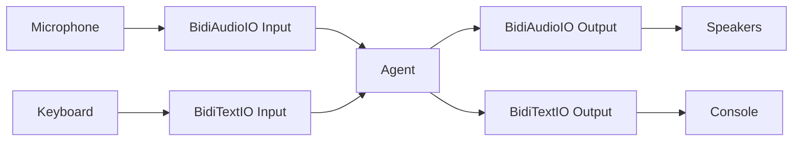

# I/O Channels

I/O channels handle the flow of data between your application and the bidirectional streaming agent. They manage input sources (microphone, keyboard, WebSocket) and output destinations (speakers, console, UI) while the agent focuses on conversation logic and model communication.

The bidirectional streaming system provides two built-in I/O implementations:

- **BidiAudioIO**: Hardware audio input/output using PyAudio for voice conversations
- **BidiTextIO**: Terminal text input/output using prompt_toolkit for text-based interactions

Both implementations follow the same protocol-based design, allowing you to mix and match I/O channels or use multiple outputs simultaneously.



## How I/O Channels Work

I/O channels operate independently from the agent's core logic through a protocol-based interface. Each channel implements two key methods:

- **Input channels** continuously read data from a source and convert it to events
- **Output channels** receive events from the agent and handle them appropriately

### Integration with Agent

When you call `agent.run()`, the agent automatically manages I/O channels:

```python
import asyncio
from strands.experimental.bidi import BidiAgent, BidiAudioIO
from strands.experimental.bidi.models import BidiNovaSonicModel

model = BidiNovaSonicModel()
agent = BidiAgent(model=model)
audio_io = BidiAudioIO()

async def main():
    await agent.run(
        inputs=[audio_io.input()],
        outputs=[audio_io.output()]
    )

asyncio.run(main())
```

The agent handles the complete lifecycle:

1. **Startup**: Calls `start(agent)` on each I/O channel, passing the agent instance so channels can access model configuration
2. **Operation**: Creates concurrent tasks that continuously read from inputs and write to outputs
3. **Shutdown**: Calls `stop()` on each channel to clean up resources

### Audio Configuration Flow

I/O channels automatically configure themselves based on the model's audio requirements:

```python
from strands.experimental.bidi import BidiAgent, BidiAudioIO
from strands.experimental.bidi.models import BidiGeminiLiveModel

# Model specifies audio configuration
model = BidiGeminiLiveModel(
    provider_config={
        "audio": {
            "input_rate": 16000,   # 16kHz input
            "output_rate": 24000,  # 24kHz output
            "channels": 1,         # Mono
            "format": "pcm"        # PCM encoding
        }
    }
)

agent = BidiAgent(model=model)
audio_io = BidiAudioIO()

async def main():
    # During start(), audio_io reads agent.model.config["audio"]
    # and configures hardware to match
    await agent.run(
        inputs=[audio_io.input()],
        outputs=[audio_io.output()]
    )

asyncio.run(main())
```

This ensures your audio hardware matches the model's expectations without manual configuration.

## BidiAudioIO

`BidiAudioIO` provides hardware audio input and output using PyAudio, enabling real-time voice conversations with automatic audio format handling and interruption support.

### Basic Usage

```python
import asyncio
from strands.experimental.bidi import BidiAgent, BidiAudioIO
from strands.experimental.bidi.models import BidiNovaSonicModel

model = BidiNovaSonicModel()
agent = BidiAgent(model=model, system_prompt="You are a helpful voice assistant.")
audio_io = BidiAudioIO()

async def main():
    await agent.run(
        inputs=[audio_io.input()],
        outputs=[audio_io.output()]
    )

asyncio.run(main())
```

This creates a voice-enabled agent that listens to your microphone, sends audio to the model in real-time, plays responses through your speakers, and automatically handles interruptions.

### Audio Input

The audio input channel reads from your microphone and converts audio data to `BidiAudioInputEvent` objects that the agent sends to the model.

**Key Features:**

- Continuous audio capture in the background
- Automatic format conversion (hardware → base64-encoded PCM)
- Configurable buffer sizes for latency tuning
- Thread-safe operation with PyAudio callbacks

**Configuration:**

```python
audio_io = BidiAudioIO(
    input_buffer_size=10,           # Max chunks in queue (default: unbounded)
    input_device_index=1,           # Specific microphone (default: system default)
    input_frames_per_buffer=512     # Chunk size in frames (default: 512)
)
```

- **Buffer Size**: Controls memory usage. Use `None` (default) for unbounded queues
- **Device Index**: Specifies which microphone to use (see [Selecting Audio Devices](#selecting-audio-devices))
- **Frames Per Buffer**: Smaller values reduce latency but increase CPU usage (default: 512)

### Audio Output

The audio output channel receives `BidiAudioStreamEvent` objects from the agent and plays them through your speakers.

**Key Features:**

- Continuous audio playback in the background
- Automatic format conversion (base64-encoded PCM → hardware)
- Buffer clearing on interruptions for immediate silence
- Thread-safe operation with PyAudio callbacks

**Configuration:**

```python
audio_io = BidiAudioIO(
    output_buffer_size=20,          # Max chunks in queue (default: unbounded)
    output_device_index=2,          # Specific speaker (default: system default)
    output_frames_per_buffer=512    # Chunk size in frames (default: 512)
)
```

- **Buffer Size**: Larger buffers provide smoother playback but increase latency
- **Device Index**: Specifies which speaker to use (see [Selecting Audio Devices](#selecting-audio-devices))
- **Frames Per Buffer**: Larger values reduce CPU usage but increase latency (default: 512)

### Interruption Handling

`BidiAudioIO` automatically handles interruptions by clearing the output buffer when the user starts speaking. This creates natural, human-like conversations where users can interrupt the agent mid-response.

```python
import asyncio
from strands.experimental.bidi import BidiAgent, BidiAudioIO
from strands.experimental.bidi.models import BidiNovaSonicModel
from strands.experimental.bidi.types.events import (
    BidiInterruptionEvent,
    BidiResponseCompleteEvent,
    BidiTranscriptStreamEvent
)

async def main():
    model = BidiNovaSonicModel()
    audio_io = BidiAudioIO()
    
    async with BidiAgent(model=model) as agent:
        await agent.send("Tell me a long story about space exploration")
        
        interruption_count = 0
        
        async for event in agent.receive():
            if isinstance(event, BidiTranscriptStreamEvent):
                print(f"{event.role}: {event.text}")
            
            elif isinstance(event, BidiInterruptionEvent):
                interruption_count += 1
                print(f"[Interrupted by {event.reason}]")
                # Audio output automatically cleared and playback stopped
            
            elif isinstance(event, BidiResponseCompleteEvent):
                if event.stop_reason == "interrupted":
                    print(f"Response was interrupted (total: {interruption_count})")
                break

asyncio.run(main())
```

When an interruption occurs, the model detects user speech via voice activity detection, emits a `BidiInterruptionEvent`, automatically clears the audio output buffer to stop playback immediately, and becomes ready for new input.

### Configuring Audio Performance

#### Selecting Audio Devices

To list available audio devices and select specific ones:

```python
import pyaudio

# List all audio devices
p = pyaudio.PyAudio()
print("Available audio devices:")
for i in range(p.get_device_count()):
    info = p.get_device_info_by_index(i)
    print(f"{i}: {info['name']} (inputs: {info['maxInputChannels']}, outputs: {info['maxOutputChannels']})")
p.terminate()

# Use specific devices
from strands.experimental.bidi import BidiAudioIO

audio_io = BidiAudioIO(
    input_device_index=1,   # Use device 1 for input
    output_device_index=2   # Use device 2 for output
)
```

#### Performance Tuning

**For Low Latency:**

```python
# Smaller buffers and chunk sizes
audio_io = BidiAudioIO(
    input_frames_per_buffer=256,    # Smaller chunks
    output_frames_per_buffer=256,
    output_buffer_size=5            # Smaller queue
)
```

**For Smooth Playback:**

```python
# Larger buffers and chunk sizes
audio_io = BidiAudioIO(
    input_frames_per_buffer=1024,   # Larger chunks
    output_frames_per_buffer=1024,
    output_buffer_size=50           # Larger queue
)
```

**For Low CPU Usage:**

```python
# Larger chunk sizes reduce callback frequency
audio_io = BidiAudioIO(
    input_frames_per_buffer=2048,
    output_frames_per_buffer=2048
)
```

## BidiTextIO

`BidiTextIO` provides terminal-based text input and output using prompt_toolkit, enabling text-based conversations and transcript monitoring.

### Basic Usage

```python
import asyncio
from strands.experimental.bidi import BidiAgent, BidiTextIO
from strands.experimental.bidi.models import BidiNovaSonicModel

model = BidiNovaSonicModel()
agent = BidiAgent(model=model, system_prompt="You are a helpful text assistant.")
text_io = BidiTextIO()

async def main():
    await agent.run(
        inputs=[text_io.input()],
        outputs=[text_io.output()]
    )

asyncio.run(main())
```

This creates a text-based agent that reads user input from the terminal, sends text messages to the model, and prints transcripts and responses to the console.

### Text Input

The text input channel reads from stdin using prompt_toolkit's async prompt session.

**Key Features:**

- Async input reading (non-blocking)
- Configurable prompt string
- Line editing and history support (via prompt_toolkit)
- Automatic whitespace trimming

**Configuration:**

```python
text_io = BidiTextIO(
    input_prompt="You: "  # Custom prompt (default: blank)
)
```

### Text Output

The text output channel prints events to stdout, including transcripts, interruptions, and connection status.

**Events Handled:**

- `BidiTranscriptStreamEvent`: Prints speech transcripts (user and assistant)
- `BidiInterruptionEvent`: Prints "interrupted" message
- `BidiConnectionCloseEvent`: Prints closure reason for user-requested stops

**Example Output:**

```
You: What's the weather?
Preview: Let me check
Let me check the weather for you.
interrupted
You: Actually, tell me a joke instead
Preview: Sure
Sure! Why did the programmer quit his job? Because he didn't get arrays!
```

**Preview Transcripts:**

Non-final transcripts are prefixed with "Preview:" to indicate they may change:

```python
# Non-final transcript
Preview: Let me check the wea

# Final transcript
Let me check the weather for you.
```

### Common Use Cases

Text I/O is useful for text-only conversations, monitoring audio conversations with transcript output, and testing agent responses without audio hardware.

## Combining I/O Channels

You can combine multiple input and output channels simultaneously for multi-modal interactions.

### Multiple Outputs

Use multiple outputs to monitor conversations in different ways:

```python
import asyncio
from strands.experimental.bidi import BidiAgent, BidiAudioIO, BidiTextIO
from strands.experimental.bidi.models import BidiNovaSonicModel

model = BidiNovaSonicModel()
agent = BidiAgent(model=model)

audio_io = BidiAudioIO()
text_io = BidiTextIO()

async def main():
    # Voice conversation with text transcript monitoring
    await agent.run(
        inputs=[audio_io.input()],
        outputs=[audio_io.output(), text_io.output()]
    )

asyncio.run(main())
```

Both outputs receive all events simultaneously. This is useful for debugging, logging transcripts, providing visual feedback for accessibility, or development and testing.

### Multiple Inputs

Provide multiple input sources for flexible interaction methods:

```python
import asyncio
from strands.experimental.bidi import BidiAgent, BidiAudioIO, BidiTextIO
from strands.experimental.bidi.models import BidiNovaSonicModel

model = BidiNovaSonicModel()
agent = BidiAgent(model=model)

audio_io = BidiAudioIO()
text_io = BidiTextIO(input_prompt="Text: ")

async def main():
    # Both audio and text input available
    await agent.run(
        inputs=[audio_io.input(), text_io.input()],
        outputs=[audio_io.output(), text_io.output()]
    )

asyncio.run(main())
```

Users can speak or type messages, and the model responds to whichever input arrives first. This provides flexible input methods and fallback options when audio hardware is unavailable.

### Multi-Modal Configuration

Configure each I/O channel independently when combining them:

```python
import asyncio
from strands.experimental.bidi import BidiAgent, BidiAudioIO, BidiTextIO
from strands.experimental.bidi.models import BidiGeminiLiveModel

# Configure model for high-quality audio
model = BidiGeminiLiveModel(
    provider_config={
        "audio": {
            "input_rate": 48000,
            "output_rate": 24000,
            "voice": "Puck"
        }
    }
)

agent = BidiAgent(model=model)

# Configure audio I/O for low latency
audio_io = BidiAudioIO(
    input_frames_per_buffer=256,
    output_frames_per_buffer=256,
    output_buffer_size=10
)

# Configure text I/O with custom prompt
text_io = BidiTextIO(input_prompt="[Text] You: ")

async def main():
    await agent.run(
        inputs=[audio_io.input(), text_io.input()],
        outputs=[audio_io.output(), text_io.output()]
    )

asyncio.run(main())
```

## WebSocket as I/O Channel

WebSocket connections can serve as I/O channels for web applications. Since the agent's `run()` method accepts any callable that sends and receives JSON, WebSocket methods work directly as input and output channels without requiring custom wrappers.

### FastAPI Example

```python
from fastapi import FastAPI, WebSocket
from strands.experimental.bidi import BidiAgent
from strands.experimental.bidi.models import BidiNovaSonicModel
from strands_tools import calculator

app = FastAPI()

@app.websocket("/ws")
async def websocket_endpoint(websocket: WebSocket):
    """WebSocket endpoint for real-time bidirectional communication."""
    await websocket.accept()
    
    model = BidiNovaSonicModel()
    agent = BidiAgent(
        model=model,
        tools=[calculator],
        system_prompt="You are a helpful assistant."
    )
    
    try:
        # Pass WebSocket send/receive directly to agent.run()
        await agent.run(
            inputs=[websocket.receive_json],
            outputs=[websocket.send_json]
        )
    except Exception as e:
        print(f"Error: {e}")
    finally:
        await websocket.close()
```

The client sends audio events as JSON:

```javascript
// Client sends audio from microphone
const audioEvent = {
    type: "bidi_audio_input",
    audio: base64AudioData,  // base64-encoded PCM
    format: "pcm",
    sample_rate: 16000,
    channels: 1
};
websocket.send(JSON.stringify(audioEvent));

// Client receives audio and transcripts
websocket.onmessage = (event) => {
    const data = JSON.parse(event.data);
    
    if (data.type === "bidi_audio_stream") {
        // Play audio response
        playAudio(data.audio);
    } else if (data.type === "bidi_transcript_stream") {
        // Display transcript
        console.log(`${data.role}: ${data.text}`);
    }
};
```

This pattern enables:

- Real-time audio streaming between browser and agent
- Live transcription of conversations
- Tool execution during conversations
- Multiple concurrent client connections

For production use, add authentication, error handling, connection management, and rate limiting.

## Next Steps

- [Agent](../agent.md) - Learn about BidiAgent configuration and lifecycle
- [Events](../events.md) - Understand the events flowing through I/O channels
- [Quickstart](../quickstart.md) - Get started with bidirectional streaming
- [API Reference](../../../../api-reference/experimental/bidi/io.md) - Complete I/O API documentation
